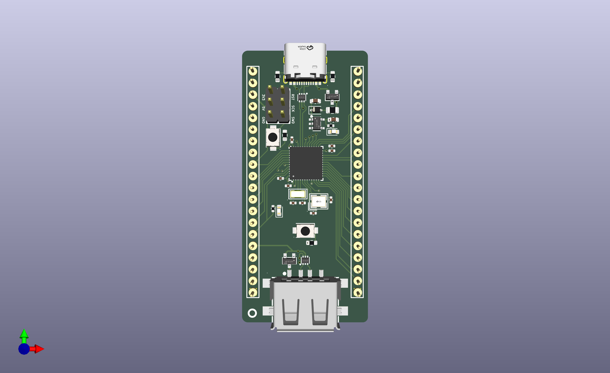
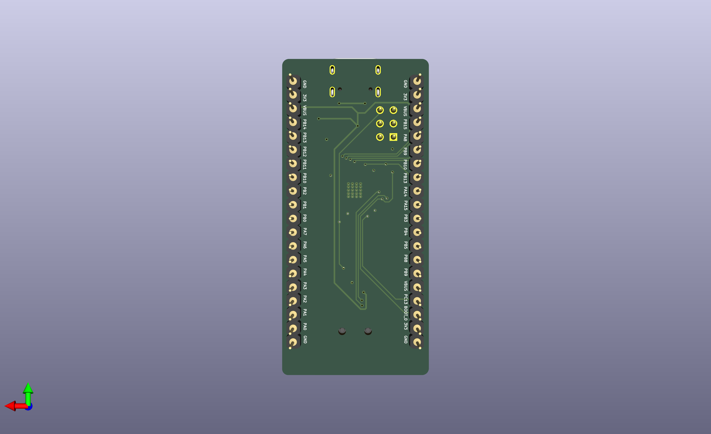
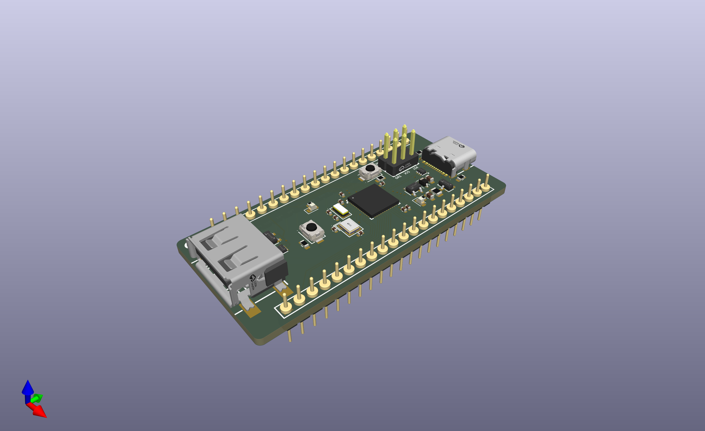

# ch32v203-devboard

Just another CH32V203 development board.

With dual USB, exposed GPIOs, and a SWD header, this board is meant to make it easy to create projects for the CH32V203 microcontroller.

## Screenshots

## BOM

| Qty | Designators | Description | Footprint |
| --- | --- | --- | --- |
| 2 | C1, C2 | 10 uF capacitors | `Capacitor_SMD:C_0603_1608Metric` |
| 4 | C3, C4, C9, C10 | 15 pF capacitors | `Capacitor_SMD:C_0402_1005Metric` |
| 3 | C5, C6, C7 | 100 nF capacitors | `Capacitor_SMD:C_0402_1005Metric` |
| 1 | C8 | 4.7 uF capacitor | `Capacitor_SMD:C_0402_1005Metric` |
| 1 | C11 | 10 uF capacitor | `Capacitor_SMD:C_0402_1005Metric` |
| 2 | D1, D2 | USBLC6-2P6 ESD protection | `ch32v203_dev:SOT-666-6_L1.6-W1.2-P0.50-LS1.6-BL` |
| 1 | F1 | JK-SMD0805-020-30V fuse | `Fuse:Fuse_0805_2012Metric` |
| 2 | H1, H2 | 1x20 2.54 mm pin headers | `ch32v203_dev:HDR-TH_20P-P2.54-V-M_4` |
| 1 | LED1 | User LED, XL-1608UGC-04 | `LED_SMD:LED_0603_1608Metric` |
| 1 | LDO1 | ME6211C33M5G-N 3.3 V LDO | `ch32v203_dev:SOT-23-5_L3.0-W1.7-P0.95-LS2.8-BL` |
| 1 | PWR1 | Power LED, NCD0603R1 | `LED_SMD:LED_0603_1608Metric` |
| 2 | R2, R3 | 10 kOhm resistors | `Resistor_SMD:R_0603_1608Metric` |
| 2 | R4, R5 | 1 kOhm resistors | `Resistor_SMD:R_0402_1005Metric` |
| 2 | R1, R6 | 5.1 kOhm resistors | `Resistor_SMD:R_0603_1608Metric` |
| 2 | RESET1, RESET2 | SMD tactile switches | `ch32v203_dev:SW-SMD_L3.9-W3.0-P4.45` |
| 1 | U1 | CH32V203C8U6 MCU | `ch32v203_dev:TQFN-48_L7.0-W7.0-P0.50-BL-EP5.5` |
| 1 | U2 | 2x3 2.54 mm SWD header | `ch32v203_dev:HDR-TH_6P-P2.54-V-M-R3-C2-S2.54_2` |
| 1 | U3 | 32.768 kHz crystal | `ch32v203_dev:CRYSTAL-SMD_L3.2-W1.5-1` |
| 1 | U4 | USB-C receptacle KH-TYPE-C-16P | `ch32v203_dev:USB-C-SMD_KH-TYPE-C-16P` |
| 1 | U5 | SD101CWS diode | `Diode_SMD:D_SOD-323` |
| 2 | U6, U7 | DMG2305UX-7 MOSFET | `ch32v203_dev:SOT-23-3_L2.9-W1.3-P1.90-LS2.4-BR` |
| 1 | USB2 | USB-A receptacle 10.0 QTJ6.3 | `ch32v203_dev:USB-A-SMD_10.0-QTJ6.3` |
| 1 | X1 | 8 MHz crystal | `ch32v203_dev:CRYSTAL-SMD_4P-L3.2-W2.5-BL` |

## Some notes

- You can either program the board using the USB-C port (by pressing the BOOT button while plugging in the USB cable) or using the SWD header.
- The board has a built-in LED mapped to PB9.
- The board dimensions are 27.9mm (takes 10 breadboard pins) x 59.9mm
